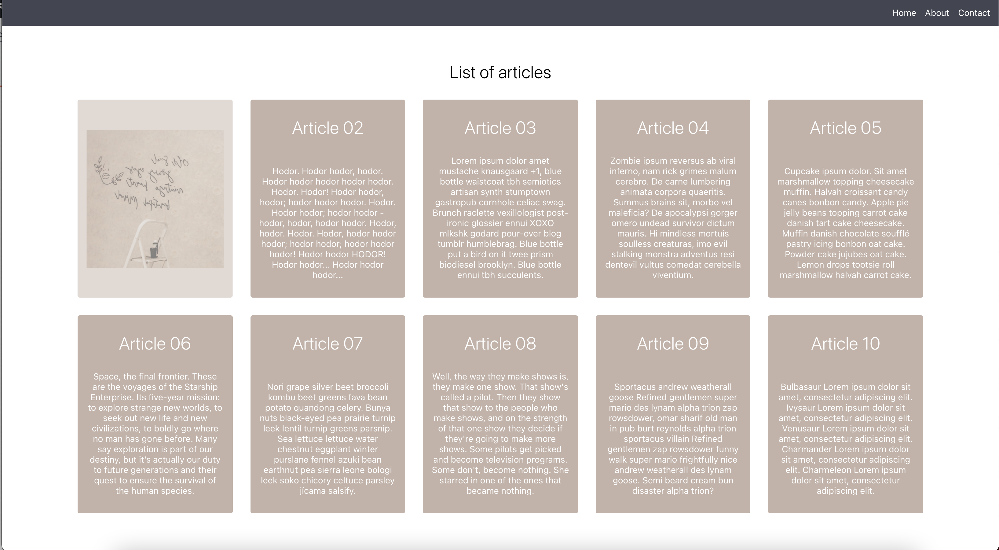

# Day 22 Morning Challenge

# Instructions

- Make a web design like this 

[Demo Video](https://www.loom.com/share/80b39f14b7394159a476b573ff2e900e)

- Make use of the template code present there
- You have to use the [styled component](https://www.npmjs.com/package/styled-components)
- **On hover a particular card it flips and shows the image behind it**
- Refer data.json for the format of data
